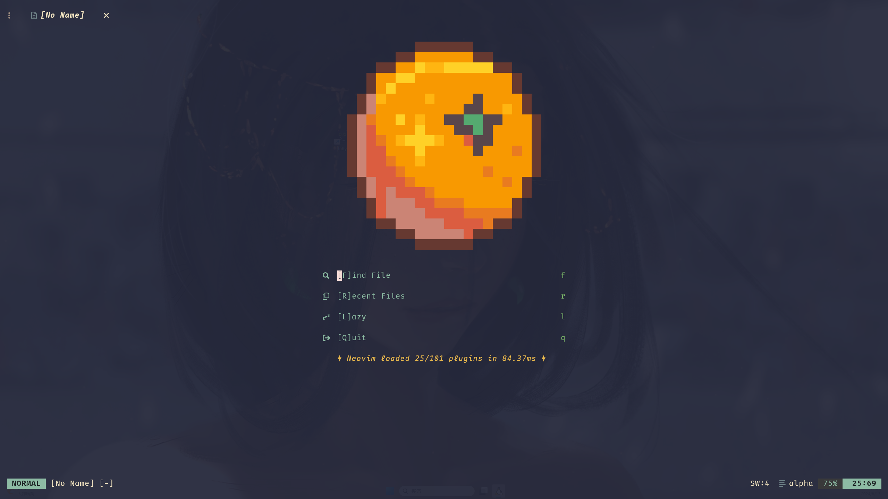

# The overview of my Neovim

## Introduction

This is a configuration of neovim, which mainly used for developing Python
and C/C++ with CMake.
Sometimes write some notes too.

It is highly recommond integer with [Kitty](https://github.com/kovidgoyal/kitty).

## Preview

## Installation

1. Install the [Neovim](https://github.com/neovim/neovim) first with
the package manager, manually build it, or use the binary version.

2. Install the dependencies(TODO: Improve the dependencies).

3. Clone this repo and ensure all files under this floder in the **$XDG_CONFIG_HOME/nvim**.
